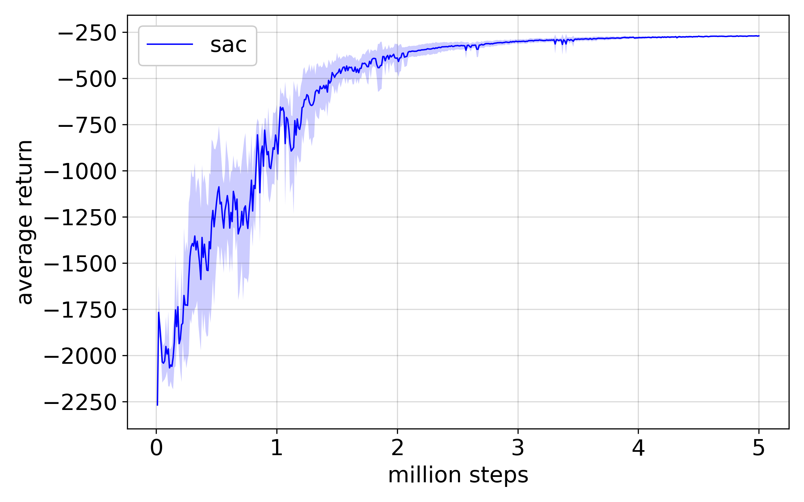
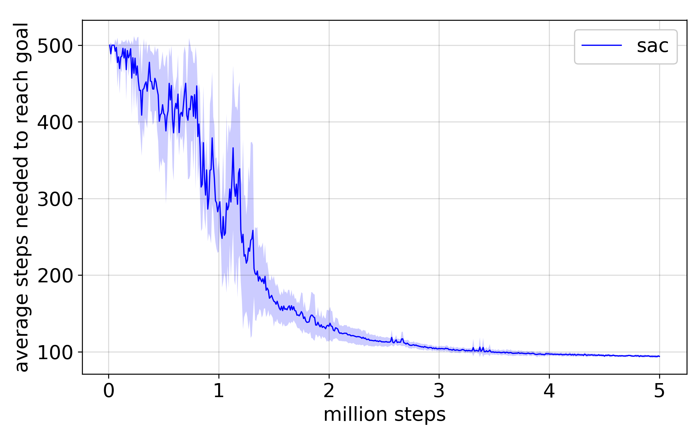

<!--
Copyright (C) 2020, 2023 Mitsubishi Electric Research Laboratories (MERL)

SPDX-License-Identifier: AGPL-3.0-or-later
-->
# Solve MAZE with Model-free RL

## Installation

Before starting, please install maze_simulator by following [docs/install_maze_simulator.md](../../docs/install_maze_simulator.md).

After that, install dependencies that will be needed for this experiment

```bash
# Following two commands are needed if you haven't built maze_simulator
$ bash install.sh
$ source install/setup_env.sh

# Build environment
$ conda create -n maze_rl python=3.8 anaconda
$ conda install scipy scikit-learn pyqtgraph cudatoolkit=10.1 cudnn=7.6
$ pip install -r requirements.txt
$ pip install -r requirements_rl.txt
```

## Experiments

### All at same time

`--concurrent` option specifies number of experiments that run parallelly. Suggested number is number of cores your computer has.

```bash
$ python experiments/rl/run_all.py --concurrent 5
```

If you want to run SAC or PPO each, do as follows:

```bash
$ python experiments/rl/run_sac.py
```

You can see the training process by using TensorBoard

```bash
$ tensorboard --logdir results/rl
```

### Generate result figure

After running `run_all.py` above, the results are stored in `results/rl` directory as:

```bash
$ tree -d -L 2 results/rl
results/rl
└── sac
    ├── 20200122T162657.244834_SAC_
    ├── 20200122T162701.879444_SAC_
    ├── 20200122T162704.054488_SAC_
    ├── 20200122T162705.980918_SAC_
    └── 20200122T162707.903623_SAC_
```

Then, generate result figure by:

```bash
$ python experiments/rl/make_compare_graph.py -i results/rl --legend
```

You will find following pictures in the current directory.

|             Average test return              | Averate steps to reach goal state           |
| :------------------------------------------: | ------------------------------------------- |
|  |  |
